# Introduction to developing for OS X: Getting Started

## Introduction
- What is OS X?
- Why would you want to develop for it?
- Apple makes it easy
- Outline this article

## Prerequisites

To become an expert OS X developer, you will need a few things:

- __Mac running OS X__ The OS X operating system only runs on Apple computers, so you need a Mac both to develop and run OS X apps.
- __An AppleID__ In order to download the tools from the App Store, you'll need an AppleID.
- __Xcode__ This is the IDE and toolchain used to create OS X apps. You'll learn how to install this in the next section.

Once you've built your app, and you want to upload it to the App Store to be distributed, you'll also need to pay for an Apple developer account. But this is not a requirement until you are ready to send your app out to the world.

## Obtaining Tools

Unlike some other platforms, developing for OS X requires the installation of one tool - known as Xcode. Xcode is an IDE that includes everything you need to develop iOS, watchOS and OS X apps.

You can download the currently released stable version of Xcode from the Mac App Store:


Once it has downloaded and installed, you can go ahead an open it. The first time you open Xcode it'll ask to install some additional components. Go ahead and let it, entering your password if required.

You'll then be presented with the Xcode welcome screen:


Congratulations, you've successfully installed Xcode! Read on to learn all about what it can do.

### Beta versions of Xcode

Before moving on to describing the power of Xcode, it's worth taking a few minutes learning about beta versions of Xcode. When Apple releases new updates to Xcode (often to support new features in OS X, iOS and watchOS) they go through an agressive cycle of beta releases. These releases include the new features, but consequently many bugs. If you are interested in developing an app which leverages these new features, you'll need to download the latest beta from Apple.

Apple releases betas of its developer software at [developer.apple.com](https://developer.apple.com/). You can install a beta version of Xcode alongside the stable version, so there's no problem with continuing work on projects that aren't ready for upgrade.


The download is a DMG, so you can install by dragging the Xcode app across into __Applications__ in the usual way. You'll then have two versions of Xcode available in Launchpad:


> __Note:__ At the time of writing Xcode 7 is still in beta. The sample project used in this tutorial has been upgraded to use the Swift 2.0 programming language, and therefore requires Xcode 7. If you wish to follow along you will need to download a beta of Xcode 7, as described in this section.

## Xcode

Xcode is an Integrated Development Environment (IDE) which means that it is a collection of all the tools you need, from source code editing, compilation through to debugging and UI design.

When you open Xcode it allows you to create a new project, or open an existing one. You can also open an existing project by double clicking on an Xcode project or workspace in Finder:

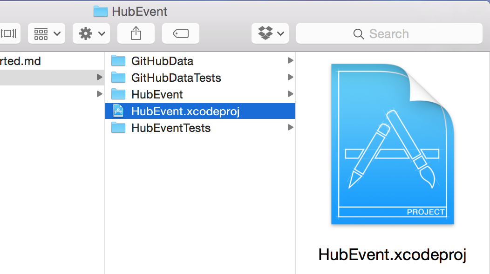

Download the __HubEvent__ sample project, unzip it and __double click__ on __HubEvent.xcodeproj__ in Finder to open it in Xcode.

### Creating a new app

In this tutorial you'll tour Xcode via a sample app, but when you want to create you own projects you can select __Create a new Xcode project__ from the Xcode welcome screen:


The template chooser allows you to decide how Xcode will configure your new project. In the __OS X \ Application__ section you can see the three different core OS X app types:

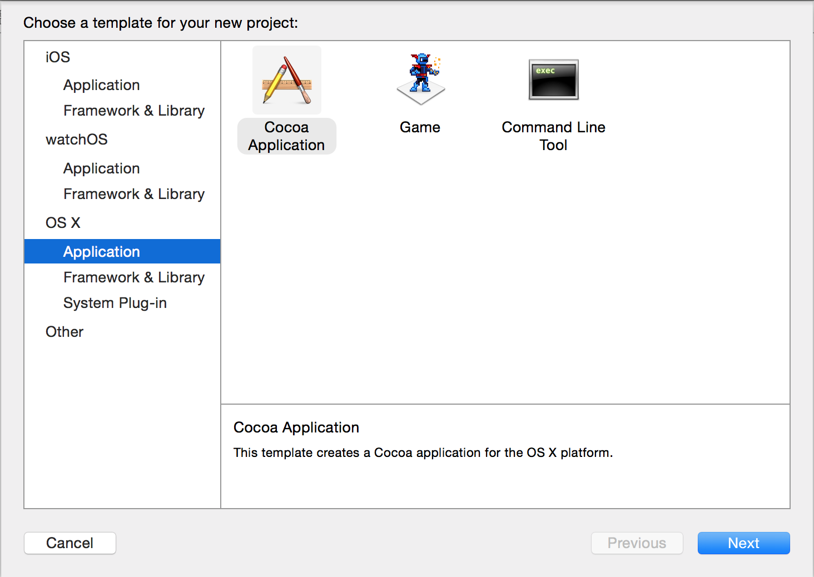

The three different app types are as follows:

- __Cocoa Application__ An OS X desktop app - with a window-based UI. Cocoa is the name of the framework upon which all OS X applications are built.
- __Game__ Games built using Apple's SpriteKit or SceneKit frameworks.
- __Command Line Tool__ A utility that runs in a shell, and has a text-based UI.

There are many other project types you can create, but these cover the most popular. You can explore the other templates in the template chooser.

### Running your app

Whether you've opened an existing app or created a new one, the most important thing you'll want to do is to build and run it.

This involves compiling all of the code you've written into machine code, bundling up the resources required by the app and then executing it. This process is complex, but luckily Xcode has your back. To build and run your project simply press the __play__ button on the toolbar:

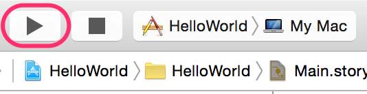

You can also build and run your app with the __⌘R__ keyboard shortcut. Do this with the __HubEvent__ sample project and you'll see it compile and then launch:

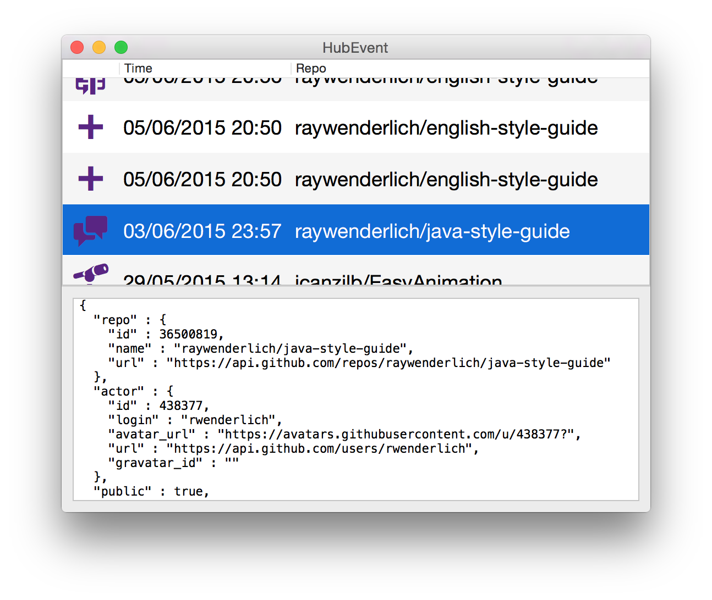

HubEvent uses the public GitHub API to pull down all the events for a user, and displays a summary of them in a table. As you select each row of the table, the raw JSON associated with that event is displayed in the panel below.

Now that you've seen how to get an app to run, you're probably desperate to find out how it works. That's coming up next!

### Code Editor

Apps are built primarily from code, written in the Swift programming language. You can also use Objective-C to write apps for OS X, but Apple introduced Swift in 2014, and was very clear that it is the langauge of the future. __HubEvent__ is written in Swift.

One of the views available in Xcode is the __Code Editor__, which is activated whenever you open a source code file. To see it, select __WindowController.swift__ from the __Controllers__ group in the __Project navigator__.

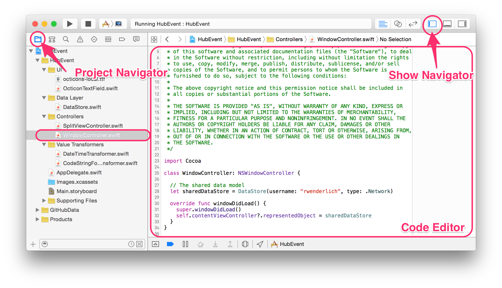

> __Note:__ You might need to show the __Navigator pane__ on the left hand side using the buttons in the toolbar, and choose the __Project navigator__ within the navigator pane. The buttons are shown the above screenshot.

In the main section of the Xcode window, you can now see the source code associated with the Window Controller. Find the following line:

```swift
// The shared data model
let sharedDataStore = DataStore(username: "rwenderlich", type: .Network)
```

This line is selecting the source of the GitHub event data - here choosing Ray's username (`rwenderlich`).

Try changing `rwenderlich` to a different GitHub username - for example `sammyd`. Then, build and run your app as you did before. You'll see the new user's events listed in the app:

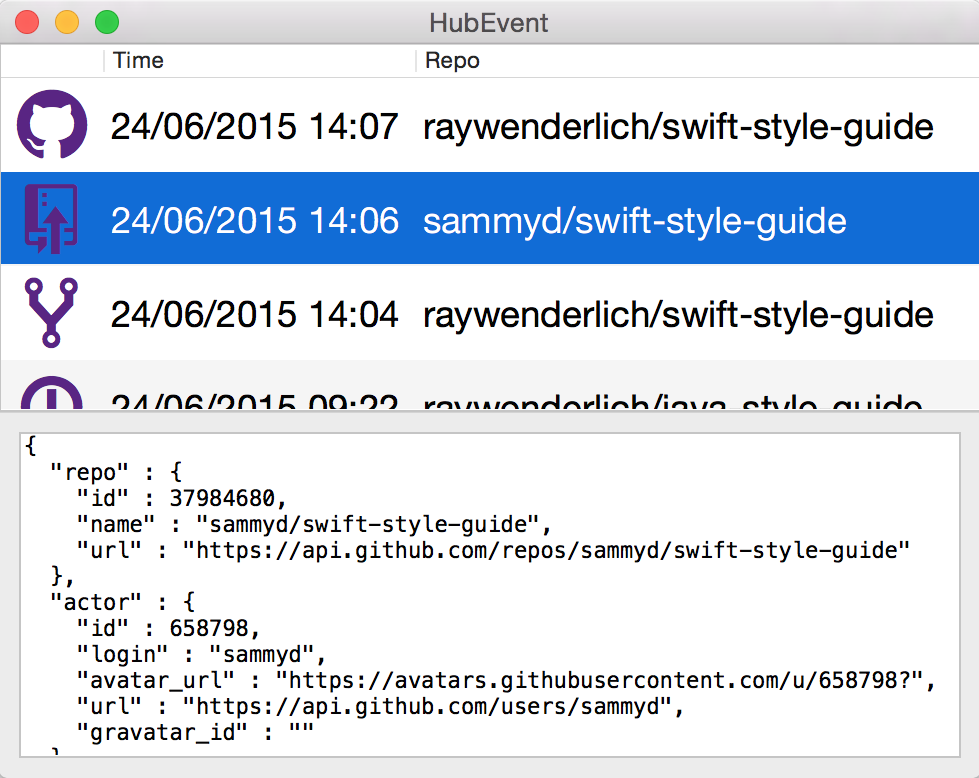

Well done! You've changed your first code in an OS X app!

The code editor includes many powerful features to assist you as your write code, including autocompletion and QuickLook documentation.


### Interface Builder

Although it is possible to build the user interface of an OS X app entirely in code, since UI is inherently visual, proceeding in this manner isn't very intuitive.

Xcode includes a tool called Interface Builder (IB), which is a fully-featured visual design tool that allows you to build your UI from reusable components.

The files which make up these visual interfaces are called Storyboards - a name inspired by the film industry. In the same way that a storyboard is used to depict scenes in a film, and the progression through it, a storyboard in an app depicts the scenes and the flow between them.

To see a storyboard in Interface Builder, select __Main.storyboard__ in the __Project navigator__:

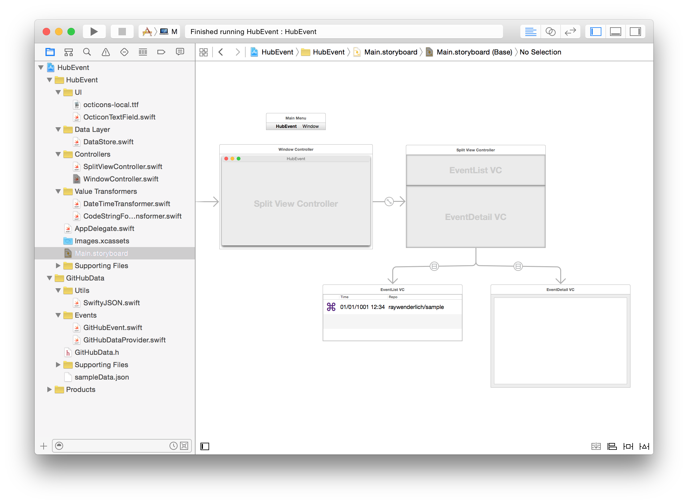

This storyboard includes the layout for the entire app. You can see how the table at the top of the app is split out as a separate entity from the JSON viewer at the bottom.

To get a really quick feel for interface builder, you're going to change the color of the icon in the left hand column.

Although being zoomed out allows you to get a good view of the entire storyboard, you can't edit a zoomed out storyboard. Zoom in to the __EventList VC__ scene using __⌘+__. This is the scene that contains the table:


Use the button in the bottom left corner to __Show Document Outline__. This is a panel along the left hand side of Interface Builder which shows you the hierarchy of components that make up the current scene.

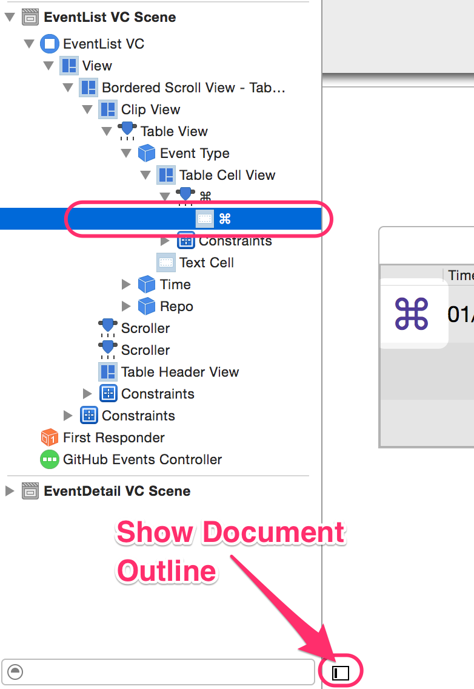

If you click on the purple __⌘__ symbol in the table view, you'll highlight the corresponding __Table Cell View__ row in the __Document Outline__. Since you want to access the text field _inside_ this cell, click on the __⌘__ again. Now you'll have the row selected as in the previous image.

Once you've selected this text field, you can configure various attributes associated with it, which determine its appearance.

If the __Utilities__ panel is not visible down the right hand side of Xcode, use the button in the toolbar to show it:


This panel can display many different inspectors, but the one you want now is the __Atrributes Inspector__. Select it now and you'll find the __Text Color__ attribute:

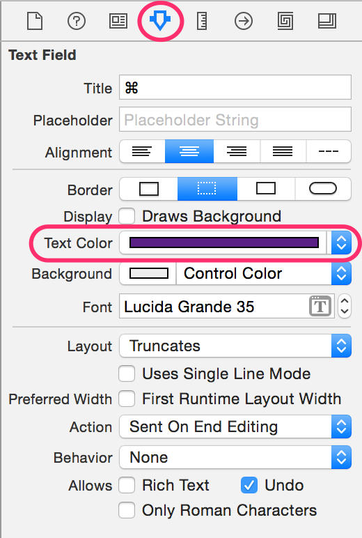

Tap on the purple color bar, and you'll see a colors panel. Use this to select a different color - e.g. yellow:

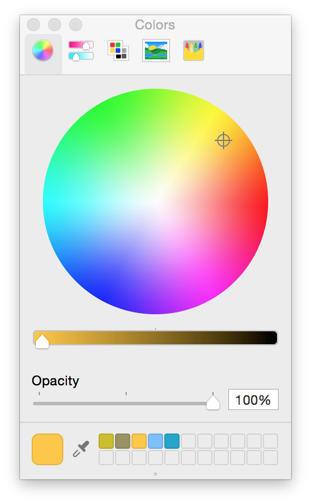

Now you can build and run __HubEvent__ again to see the effect your change has had:

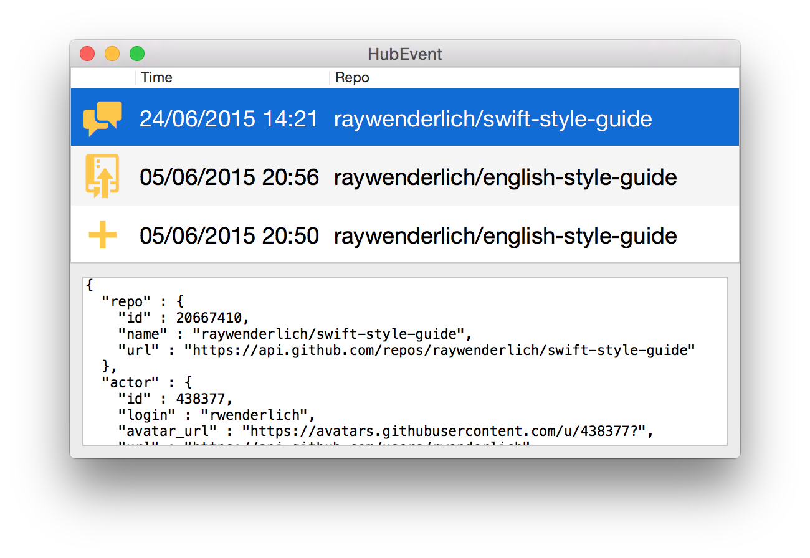

### Asset Catalog

In addition to code and user interfaces, your app will also need some assets such as artwork. Due to the different screen types (e.g. retina and non-retina), you often need to provide multiple versions of each asset. To simplify this process, Xcode uses __Asset Libraries__ to store and organize the assets that accompany the app.

__HubEvent__ already has the default asset library, called __Images.xcassets__. Select it in the __Project navigator__ to reveal its content:

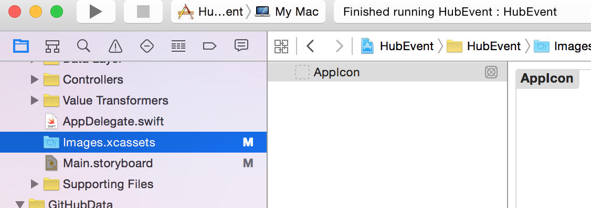

When you create a new app, the template includes an asset library, with just one entry - the app logo. This is exactly the state of the asset library in __HubEvent__. You can see the different asset types you can create by right clicking in the left pane of the library:


Currently the app icon for __HubEvent__ is the default OS X icon:

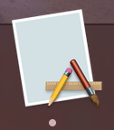

Since the app icon is provided by the asset catalog, you're going to replace it with something more appropriate. Click on the __AppIcon__ asset:

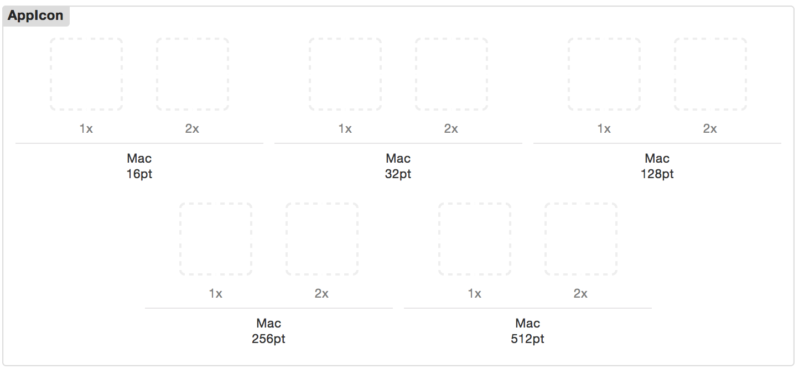

When you provide an app icon for an app, you have to provide it in many different sizes and densities for use around the system. As a demonstration, you're going to add one of these sizes to see the app icon change.

Use Finder to locate __rw_icon.png__ in the unzipped directory you downloaded. Then drag this from Finder into the __Mac 512pt 2x__ cell in the __AppIcon__ asset:

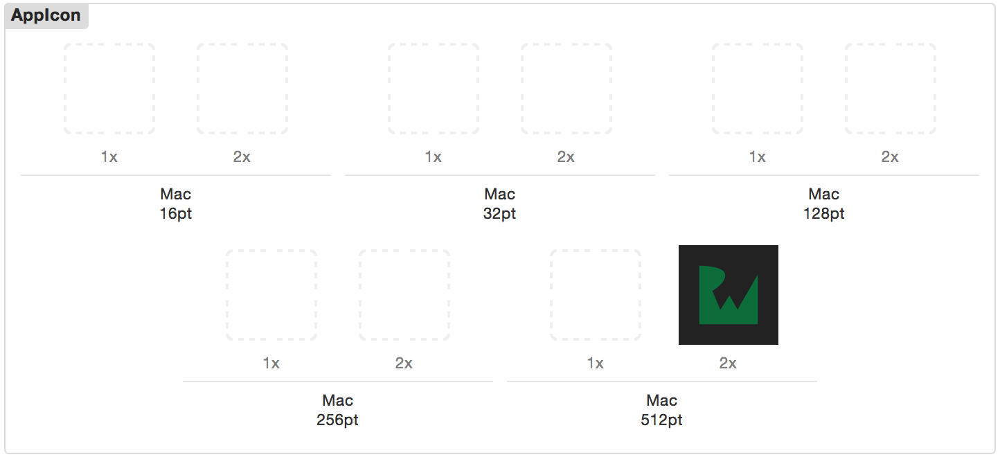

> __Note:__ Providing a single image in this manner is not generally appropriate. In a real application you should provide all ten versions of the icon.

Now build and run the app again and you'll see the updated icon in the dock:

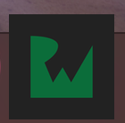


### Debugging

Nobody is capable of writing code that works perfectly every time, and therefore you're likely to spend time trying to fix problems in your code. You'll soon find that it'd be really helpful to be able to stop your app at a particular line of code and investigate the values of variables. This is precisely the functionality provided by a debugger.

Once again, Xcode is here to help. It has an integrated debugger that makes runtime investigation of your code really easy. To demonstrate some of its functionality, you're going to use it.

Open __CodeStringFormattingTransformer.swift__ by selecting it in the __Project navigator__. Find the following line in the code:

````swift
return NSAttributedString(string: unescaped, attributes: attributes)
````

__Click__ in the gutter to the left of this line to insert a __breakpoint__:

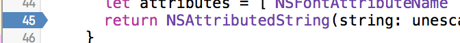

A breakpoint marks the line in your code at which point execution will stop. Your app will pause at this point to allow you to investigate the state.

__Build and run__ the app. You'll see the app start, before Xcode comes back to the foreground. You'll see the line you added the breakpoint to highlighted:


This means that your app has started running, and then reached this line of code. It has paused here to allow you to investigate.

The bottom pane in Xcode shows you the state of the variables at the current point of execution, including their variables.

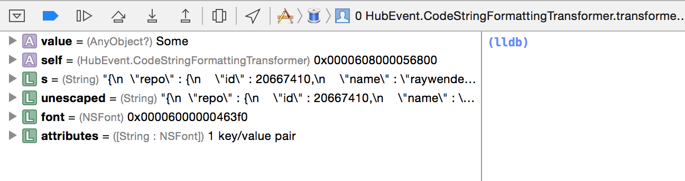

This particular method is removing escaped characters from the JSON downloaded from the GitHub API. You can see the input string `s` and the resultant string `unescaped`.

You can progress to the next line of execution with the __stepover__ button:


Or to continue the program execution, use the __continue__ button:

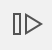

Note that continuing will then run the program until it comes across another breakpoint.

To remove a breakpoint, you can drag it out of the gutter until the pointer changes to a __x__.

This gives you a really brief introduction to the debugger in Xcode. There is loads of powerful functionality for you to discover.


### Documentation

Xcode has a couple of integrated ways to get access to documentation for system frameworks. The first is the ability to show a tooltip containing the most salient information about a class or method.

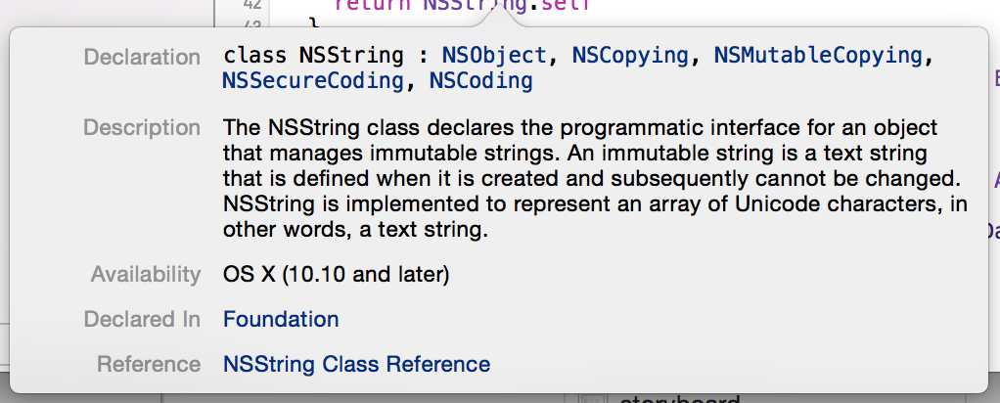

To access this, simply __Option-Click__ on a class or method name within the code editor.

The second method of accessing documentation shows you the full documentation in a dedicated browser. To access this you can either click on the __Reference__ link at the bottom of the tooltip, or use the __Window \ Documentation and Reference__ menu:

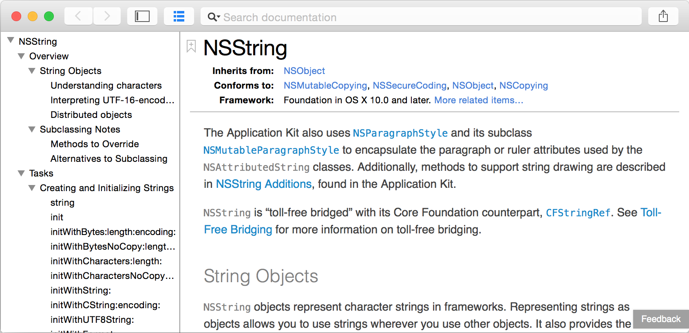


## Where to go from here?
- Next tutorial will be "Anatomy of an app"
- Links to some of Apple's docs
