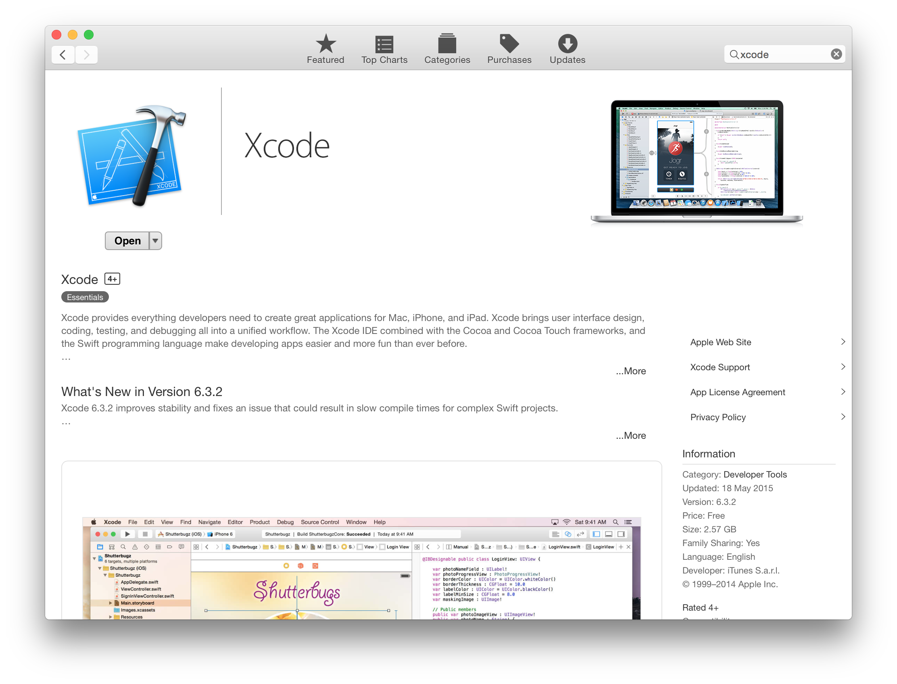
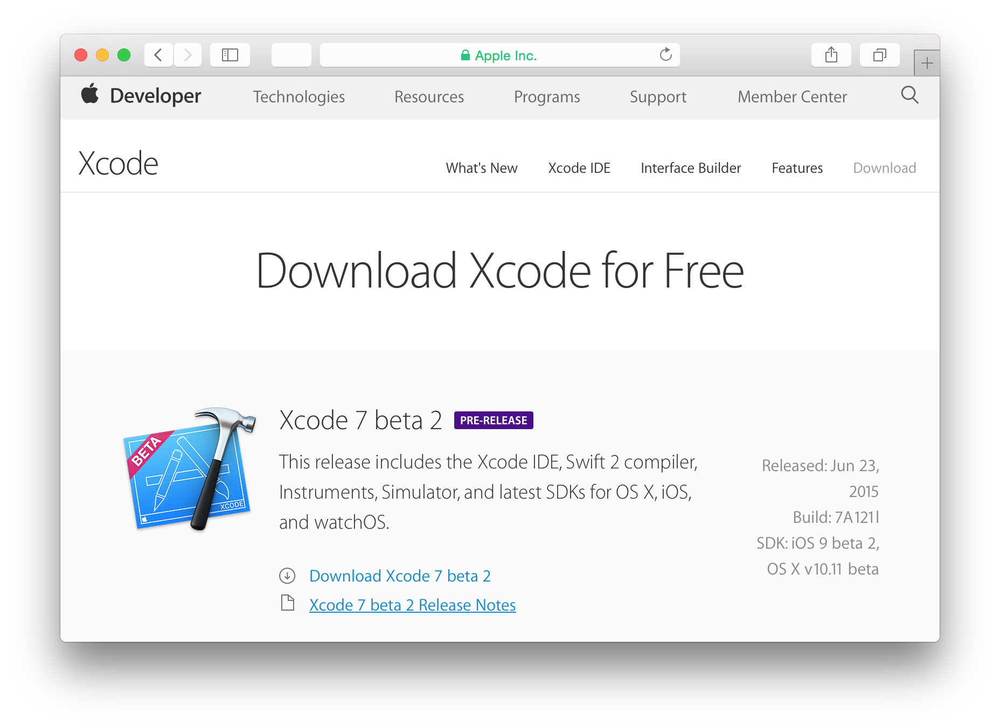
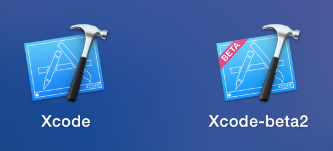

# Introduction to developing for OS X: Getting Started

## Introduction
- What is OS X?
- Why would you want to develop for it?
- Apple makes it easy
- Outline this article

## Prerequisites

To become an expert OS X developer, you will need a few things:

- __Mac running OS X__ The OS X operating system only runs on Apple computers, so you need a Mac both to develop and run OS X apps.
- __An AppleID__ In order to download the tools from the App Store, you'll need an AppleID.
- __Xcode__ This is the IDE and toolchain used to create OS X apps. You'll learn how to install this in the next section.

Once you've built your app, and you want to upload it to the App Store to be distributed, you'll also need to pay for an Apple developer account. But this is not a requirement until you are ready to send your app out to the world.

## Obtaining Tools

Unlike some other platforms, developing for OS X requires the installation of one tool - known as Xcode. Xcode is an IDE that includes everything you need to develop iOS, watchOS and OS X apps.

You can download the currently released stable version of Xcode from the Mac App Store:

Once it has downloaded and installed, you can go ahead an open it. The first time you open Xcode it'll ask to install some additional components. Go ahead and let it, entering your password if required.

You'll then be presented with the Xcode welcome screen:

Congratulations, you've successfully installed Xcode! Read on to learn all about what it can do.

### Beta versions of Xcode

Before moving on to describing the power of Xcode, it's worth taking a few minutes learning about beta versions of Xcode. When Apple releases new updates to Xcode (often to support new features in OS X, iOS and watchOS) they go through an agressive cycle of beta releases. These releases include the new features, but consequently many bugs. If you are interested in developing an app which leverages these new features, you'll need to download the latest beta from Apple.

Apple releases betas of its developer software at [developer.apple.com](https://developer.apple.com/). You can install a beta version of Xcode alongside the stable version, so there's no problem with continuing work on projects that aren't ready for upgrade.

The download is a DMG, so you can install by dragging the Xcode app across into __Applications__ in the usual way. You'll then have two versions of Xcode available in Launchpad:

> __Note:__ At the time of writing Xcode 7 is still in beta. The sample project used in this tutorial has been upgraded to use the Swift 2.0 programming language, and therefore requires Xcode 7. If you wish to follow along you will need to download a beta of Xcode 7, as described in this section.

## Xcode

- IDE - actually a collection of different tools all lumped together
- How to open a downloaded example

### Creating a new app

- Different app types
- Walkthrough creating your first app

### Running your app

- Using the play button

### Code Editor

- Integrate some really simple code
- Build and run to show the difference

### Interface Builder

- Mention storyboards.
- Make a simple change - see it work
- Throw forward to the Building UI tutorial

### Asset Catalog

- Store for assets
- Includes metadata about usage
- Add something to the catalog

### Debugging

- Explain what debugging is (very high level)
- Add a breakpoint
- Debug, show it stopped
- Look at variable values
- Continue
- Nothing more advanced

### Documentation

- Built in tooltip for code view
- Documentation browser
- How to download docs

## Where to go from here?
- Next tutorial will be "Anatomy of an app"
- Links to some of Apple's docs
